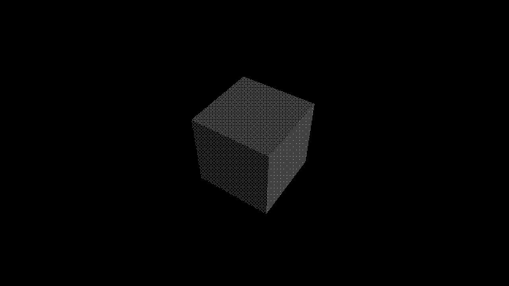
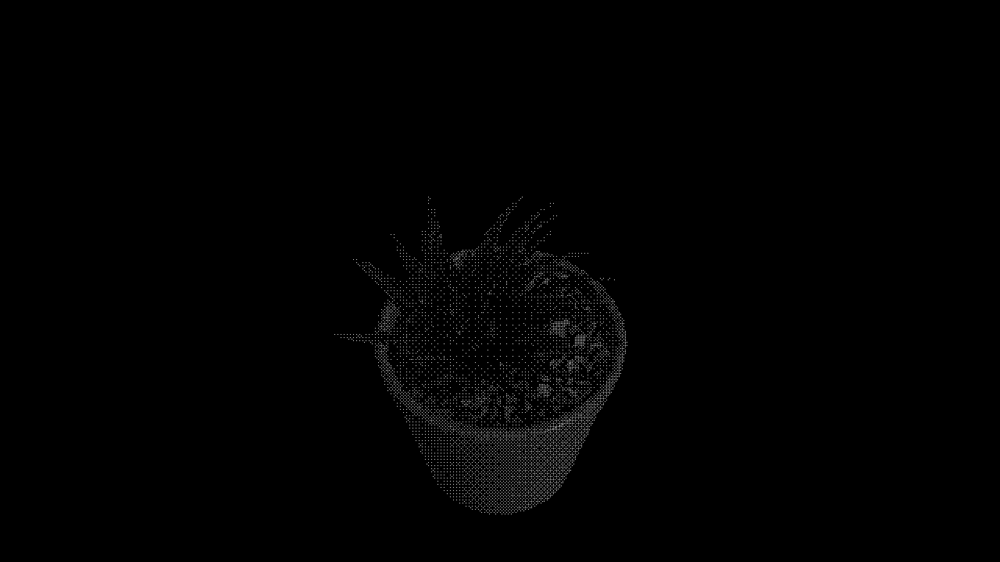

# bevy_dither_post_process

[](https://crates.io/crates/bevy_dither_post_process)


[](https://docs.rs/bevy_dither_post_process)

A plugin for the [Bevy](https://bevyengine.org) engine which adds a dither post-processing effect.

The effect is implemented as a bilevel ordered dither using a Bayer matrix with a configurable level. It dithers the image to black and white only, and operates on the entire screen.

## Screenshots


Configuration Used:
```rs
bevy_dither_post_process::components::DitherPostProcessSettings::new(3, &asset_server);
```
## Compatibility

| Crate Version | Bevy Version |
|---            |---           |
| 0.2           | 0.14         |
| 0.1           | 0.13         |

## Installation

### crates.io
```toml
[dependencies]
bevy_dither_post_process = "0.2"
```

### Using git URL in Cargo.toml
```toml
[dependencies.bevy_dither_post_process]
git = "https://github.com/exvacuum/bevy_dither_post_process.git"
```

## Usage

In `main.rs`:
```rs
use bevy::prelude::*;
use bevy_dither_post_process;

fn main() {
    App::new()
        .add_plugins((
            DefaultPlugins,
            bevy_dither_post_process::DitherPostProcessPlugin,
        ))
        .run();
}
```

When spawning a camera:
```rs
commands.spawn((
    // Camera3dBundle...
    bevy_dither_post_process::components::DitherPostProcessSettings::new(level, &asset_server);
));
```

This effect will only run for cameras which contain this component.

## License

This crate is licensed under your choice of 0BSD, Apache-2.0, or MIT license.

